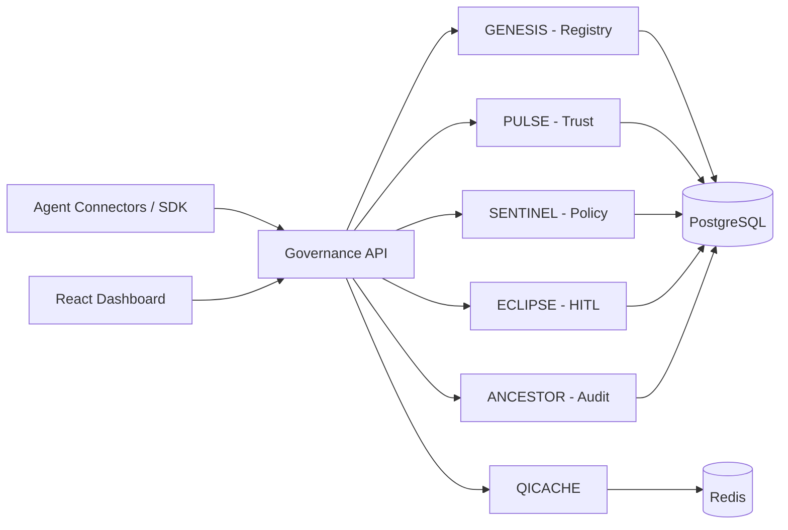

<p align="center">
  
  
  
  
  
  
</p>

<br/>

<h1 align="center">AgentGovern OS</h1>

<p align="center">
  <b>The governance operating system for autonomous AI agents.</b><br/>
  Identity. Policy enforcement. Trust scoring. Audit. Human-in-the-loop.<br/>
  Works with any agent framework. Runs anywhere.
</p>

<br/>

---

## Overview

Autonomous AI agents are operating inside enterprise systems at scale — approving invoices, authorizing payments, modifying salaries, accessing sensitive records — with no identity, no authority limits, and no audit trail.

**AgentGovern OS** is the infrastructure layer that changes this. It sits between AI agents and the actions they take, evaluating every operation against configurable policies, recording every decision immutably, and escalating high-risk actions to human administrators — all in real time, across any agent framework.

```
AI Agent  ──►  SDK Connector  ──►  POST /governance/evaluate
                                           │
                             ┌─────────────┼─────────────┐
                             ▼             ▼             ▼
                          APPROVED      BLOCKED     ESCALATED
                          (execute)   (rejected)  (HITL queue)
                                                       │
                                               Admin reviews &
                                               approves / rejects
```

Every decision — approved, blocked, or escalated — is permanently recorded in the immutable **ANCESTOR Audit Ledger** with full context, risk score, and policy trace.

---

## Table of Contents

- [Features](#features)
- [Architecture](#architecture)
- [Core Modules](#core-modules)
- [Getting Started](#getting-started)
- [Supported Agent Frameworks](#supported-agent-frameworks)
- [CLI Scanner](#cli-scanner)
- [API Reference](#api-reference)
- [Documentation](#documentation)
- [Project Structure](#project-structure)
- [Tech Stack](#tech-stack)
- [License](#license)

---

## Features

### 🔐 Agent Identity Registry (GENESIS)
Every AI agent is registered with a unique identity — framework, tier (T0–T4), authority limits, allowed and denied actions, and a cryptographic Agent Passport. You always know which agents are deployed and exactly what they are authorized to do.

### ⚡ Runtime Policy Enforcement (SENTINEL)
A 7-rule cascading policy engine evaluates every action *before* it executes:
1. Global blocked actions
2. Agent-specific denied actions
3. Authority limit check (amount vs. ceiling)
4. Trust tier ceiling enforcement
5. Escalation threshold triggers
6. Allowed actions allowlist
7. Risk score computation

The result is a `GovernanceVerdict`: `APPROVED`, `BLOCKED`, or `ESCALATED` — returned in milliseconds.

### 📈 Dynamic Trust Scoring (PULSE)
Trust is not static. Agents that perform well earn expanded autonomy; agents that fail or trigger policy violations have their authority reduced. Trust tiers (T0–T4) gate the actions an agent can perform, creating a living governance system rather than a fixed ruleset.

### 📜 Immutable Audit Ledger (ANCESTOR)
Every governance decision is stored with the full request envelope, verdict, risk score, policy matched, and timestamp. The ledger is hash-chained for integrity. This satisfies audit requirements under EU AI Act, NIST AI RMF, SOX, and similar frameworks.

### 🧑‍💼 Human-in-the-Loop (ECLIPSE)
High-risk or ambiguous actions are automatically queued in the ECLIPSE workbench. Administrators receive the full context — agent identity, requested action, risk score, policy trace — and can approve or reject with a memo. Agents wait for the decision before proceeding.

### 💾 Semantic Response Cache (QICACHE)
Semantically similar LLM queries are detected and their responses reused, reducing LLM API costs by up to 68% without sacrificing quality.

### 🔎 CLI Scanner
`agentgovern scan` detects every AI agent in a codebase, generates an **Agent Bill of Materials (ABOM)** — the AI equivalent of an SBOM — and checks the fleet against governance policy bundles. Native SARIF output integrates with GitHub Code Scanning. See [`cli/README.md`](cli/README.md).

---

## Architecture

```
┌──────────────────────────────────────────────────────────────┐
│                      AgentGovern OS                          │
├────────────┬──────────────┬──────────────┬───────────────────┤
│  CLI       │  SDK         │  Connectors  │  Dashboard        │
│ (Scanner)  │  (GovCore)   │  (7 types)   │  (React + Vite)   │
├────────────┴──────────────┴──────────────┴───────────────────┤
│                Governance API  (FastAPI)                     │
│  ┌──────────┬─────────┬──────────┬──────────┬─────────────┐  │
│  │ GENESIS  │  PULSE  │ SENTINEL │  ECLIPSE │  ANCESTOR   │  │
│  │ Registry │  Trust  │  Policy  │   HITL   │ Audit Ledger│  │
│  └──────────┴─────────┴──────────┴──────────┴─────────────┘  │
├──────────────────────────────────────────────────────────────┤
│  SQLite (dev)  ·  PostgreSQL + TimescaleDB (prod)  ·  Redis  │
└──────────────────────────────────────────────────────────────┘
```



---

## Core Modules

| Module | Code Name | Purpose |
|--------|-----------|---------|
| Agent Registry | **GENESIS** | Register agents with identity, tier, authority limits, and agent DNA |
| Trust Scoring | **PULSE** | Dynamic trust that expands or contracts based on proven performance |
| Policy Engine | **SENTINEL** | 7-rule cascading pre-execution evaluation, returning a verdict |
| Audit Ledger | **ANCESTOR** | Immutable, hash-chained log of every governance decision |
| Human-in-the-Loop | **ECLIPSE** | Escalation queue with admin approve/reject workbench |
| Response Cache | **QICACHE** | Semantic LLM response caching for cost reduction |

---

## Getting Started

See the full **[Quickstart Guide →](docs/QUICKSTART.md)** for detailed setup instructions.

### Prerequisites

- Python 3.11+
- Node.js 18+
- Docker & Docker Compose

### 1. Clone and configure

```bash
git clone https://github.com/Ritinpaul/AgentGovern-OS.git
cd AgentGovern-OS
cp .env.example .env   # Add your API keys if needed
```

### 2. Start backend services

```bash
docker compose up -d
# Starts: Governance API (8000), PostgreSQL (35432),
#         Redis (36379), ChromaDB (8001), Prometheus (9090)
```

### 3. Seed demo data

```bash
cd services/governance-api
python -m tools.seed_data   # if applicable, or skip this step
```

### 4. Start the API

```bash
# From services/governance-api/
uvicorn main:app --reload --port 8000
# Interactive API docs → http://localhost:8000/docs
```

### 5. Start the dashboard

```bash
cd frontend
npm install
npm run dev
# Dashboard → http://localhost:5173
```

### 6. Install the CLI

```bash
pip install agentgovern
# or
pipx install agentgovern

agentgovern scan .
```

---

## Supported Agent Frameworks

See the **[Connector Guide →](docs/CONNECTORS.md)** for installation and usage examples for each framework.

| Framework | Connector | Integration Pattern |
|-----------|-----------|---------------------|
| **CrewAI** | `GovernedCrew` | Drop-in wrapper — replaces `Crew(...)` |
| **LangChain** | `GovernedAgentExecutor` | Replaces `AgentExecutor` |
| **OpenAI Agents SDK** | `GovernedRunner` | Wraps the `Runner` class |
| **Anthropic** | `GovernedAnthropicClient` | Drop-in for `anthropic.Anthropic` |
| **AutoGen** | `GovernedAssistantAgent` | Extends `AssistantAgent` |
| **Any Framework** | `@governed_action` | Universal Python decorator |
| **HTTP / Webhook** | `WebhookMiddleware` | For non-Python systems |

Every connector emits a standard **GovernanceEnvelope** — a JSON schema that describes the agent, the action, and its context — ensuring framework-agnostic governance regardless of how an agent is built.

---

## CLI Scanner

The `agentgovern` CLI is a standalone, open-source AI agent security scanner — *the Black Duck for AI agents*.

```bash
# Initialize governance in a project
agentgovern init

# Scan a codebase and display the Agent Bill of Materials
agentgovern scan .

# Enforce enterprise-grade policies (fail on HIGH findings)
agentgovern scan . --policy-bundle enterprise --fail-on high

# Generate an HTML report
agentgovern scan . --format html --output report.html

# SARIF output for GitHub Code Scanning
agentgovern scan . --format sarif --output abom.sarif

# Stream the live audit ledger
agentgovern audit tail
```

**Full CLI documentation → [`cli/README.md`](cli/README.md)**

---

## Dashboard

| Page | Route | Description |
|------|-------|-------------|
| Landing | `/` | Animated product overview |
| Overview | `/dashboard` | Live KPIs: actions evaluated, trust score, violations, escalations |
| Policy Enforcer | `/dashboard/policy` | Create, edit, and manage governance policies |
| Audit Ledger | `/dashboard/audit` | Paginated, filterable decision log |
| Approvals | `/dashboard/approvals` | ECLIPSE HITL workbench — approve or reject escalated actions |
| Fleet | `/dashboard/fleet` | Registered agent inventory with tiers and DNA |
| Trust Topology | `/dashboard/trust` | Trust score visualization and leaderboard |
| Demo | `/dashboard/demo` | Live SAP dispute resolution simulation |

---

## API Reference

See the **[full API Reference →](docs/API_REFERENCE.md)** or the interactive Swagger UI at `http://localhost:8000/docs`.

### Key Endpoints

| Method | Endpoint | Description |
|--------|----------|-------------|
| `POST` | `/governance/evaluate` | **Core endpoint** — evaluate any agent action, returns verdict |
| `GET` | `/governance/metrics` | Live governance KPIs for the dashboard |
| `GET` | `/api/v1/agents/` | List all registered agents |
| `POST` | `/api/v1/agents/register` | Register a new agent |
| `PUT` | `/api/v1/agents/{code}/trust` | Update an agent's trust score |
| `GET` | `/api/v1/trust/leaderboard` | Trust score leaderboard |
| `GET` | `/api/v1/audit/` | Paginated audit log |
| `GET` | `/api/v1/escalations` | Pending HITL escalations |
| `POST` | `/api/v1/escalations/{id}/resolve` | Approve or reject an escalation |
| `GET` | `/api/v1/policies/` | Active governance policies |

---

## Documentation

| Document | Description |
|----------|-------------|
| [Quickstart Guide](docs/QUICKSTART.md) | Full setup, first evaluation, and verification steps |
| [API Reference](docs/API_REFERENCE.md) | Complete endpoint documentation with request/response schemas |
| [Connector Guide](docs/CONNECTORS.md) | Per-framework SDK connector installation and usage |
| [Demo Scenario](docs/DEMO_SCENARIO.md) | Step-by-step runbook for the SAP dispute resolution demo |
| [CLI Reference](cli/README.md) | CLI command reference, policy bundles, ABOM, and CI/CD integration |

---

## Key Innovations

| Innovation | Description |
|-----------|-------------|
| **Universal Governance Envelope** | A single JSON schema any framework connector can emit, enabling true framework-agnostic governance |
| **Agent Bill of Materials (ABOM)** | The AI equivalent of an SBOM — a complete, exportable inventory of every AI agent in a codebase |
| **7-Rule Policy Cascade** | Ordered evaluation across global rules, agent-specific rules, tier ceilings, and risk scoring — configurable without code changes |
| **Dynamic Trust Tiers (T0–T4)** | Agents earn or lose autonomy based on performance. High-performing agents are promoted; failing agents are constrained automatically |
| **Decision DNA** | Each agent carries a genetic profile — compliance threshold, learning rate, caution factor — that mutates based on outcomes over time |
| **Prophecy Engine** | Pre-execution 3-path consequence simulation that projects the likely outcomes of an action before it is approved |
| **QICACHE** | Semantic response caching that reduces LLM API costs by up to 68% by detecting and reusing answers to semantically similar queries |

---

## Project Structure

```
AgentGovern-OS/
├── cli/                        # agentgovern CLI (pip-installable scanner)
│   ├── agentgovern/            # Scanner, ABOM generator, policy engine
│   ├── tests/                  # CLI unit tests
│   └── README.md               # ← CLI documentation
├── connectors/                 # SDK connectors for 7 frameworks
│   ├── crewai/
│   ├── langchain/
│   ├── openai/
│   ├── anthropic/
│   ├── autogen/
│   ├── generic/                # Universal decorator + webhook middleware
│   └── sdk/                    # GovCore + GovernanceEnvelope core
├── docs/
│   ├── QUICKSTART.md           # ← Setup guide
│   ├── API_REFERENCE.md        # ← Full API docs
│   ├── CONNECTORS.md           # ← Connector guide
│   └── DEMO_SCENARIO.md        # ← Demo runbook
├── services/
│   ├── governance-api/         # FastAPI backend (all modules)
│   │   ├── routers/            # GENESIS, PULSE, SENTINEL, ECLIPSE, ANCESTOR…
│   │   ├── models/             # SQLAlchemy ORM models
│   │   └── tools/              # Developer utilities
│   └── crewai-engine/          # 9-agent CrewAI SAP dispute orchestration
├── frontend/                   # React + Vite + TypeScript dashboard
├── infra/                      # Prometheus, Grafana configuration
├── docker-compose.yml
└── INFO.md                     # Extended architecture reference
```

---

## Tech Stack

| Layer | Technology |
|-------|-----------|
| **Backend** | Python 3.11+, FastAPI, SQLAlchemy 2.0 (async), Pydantic v2 |
| **Database** | SQLite (development) / PostgreSQL 16 + TimescaleDB (production) |
| **Cache** | Redis 7 |
| **Frontend** | React 18, Vite, TypeScript, Tailwind CSS v4, Framer Motion, TanStack Query |
| **CLI** | Typer, Rich |
| **Multi-Agent** | CrewAI (9-agent ensemble), LangChain, OpenAI Agents SDK |
| **Observability** | Prometheus, Grafana |
| **Containers** | Docker Compose |

---

## License

Licensed under the [MIT License](LICENSE).
